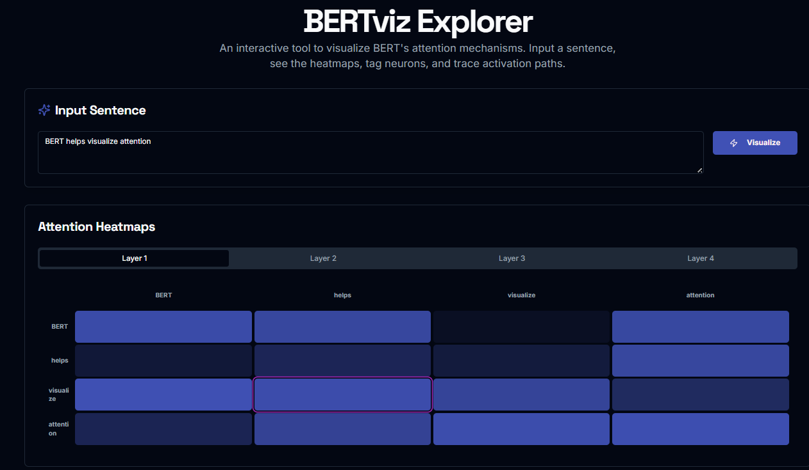

# BERTviz Explorer

An interactive visualization tool to explore **BERT's attention mechanisms** in a sentence. This tool helps researchers, ML engineers, and NLP enthusiasts understand how BERT focuses on different tokens across layers during prediction.



---

## 🚀 Features

- Visualizes attention across BERT's layers and heads
- Interactive sentence input and real-time heatmap generation
- Token-level attention insights
- Simple UI for navigating between attention layers

---

## 🧠 How It Works

Enter any sentence, and BERTViz will:

1. Tokenize the input
2. Feed it into a pretrained BERT model
3. Extract attention weights
4. Render layer-wise heatmaps showing token-to-token attention

---

## 📦 Installation

Clone the repo and install dependencies:

```bash
git clone https://github.com/Reachariramanan/BERTViz.git
cd BERTViz
pip install -r requirements.txt
npm install
````

---

## 🖥️ Run the App

Start the Python backend and the Next.js frontend:

```bash
uvicorn app:app --reload
npm run dev
```

The backend allows requests from the frontend via CORS. If you run the
frontend on another port (like the default Next.js `3000`), make sure the
backend server is running with CORS enabled so the browser can reach the
`/analyze` endpoint.

The backend exposes an `/analyze` endpoint used by the UI to fetch tokens and attention weights.

---

## 📝 Example

**Input:**
`BERT helps visualize attention`

**Output:**
Layer-wise attention heatmaps showing how each word attends to others across the network layers.

---

## 📁 Folder Structure

```
BERTViz/
├── app.py             # FastAPI server serving attentions
├── src/               # Next.js frontend
├── readme/
│   └── image.png
├── requirements.txt
└── README.md
```

---

## 🤝 Contributing

Contributions are welcome! Feel free to open issues or pull requests.

---

## 📄 License

This project is licensed under the [MIT License](LICENSE).

```
